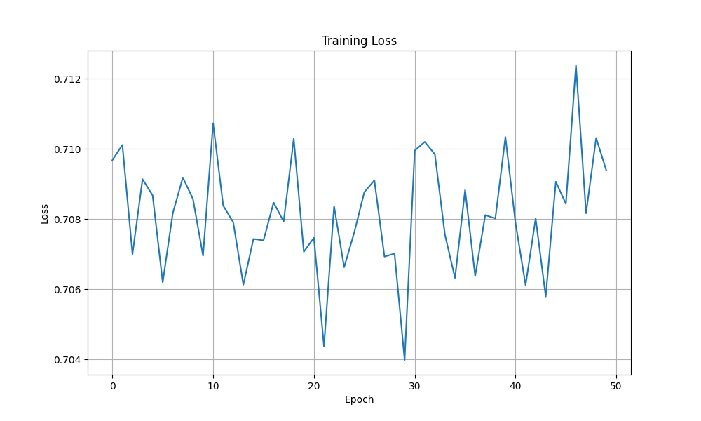

# Quantum Machine Learning System

A scalable Quantum Machine Learning System (QMLS) that demonstrates potential quantum advantage through expressivity of quantum feature maps and variational quantum circuits for classification tasks.

## Features

- **Quantum Feature Maps**: Implements multiple quantum feature mapping techniques (ZZ, Amplitude, Angle) to enhance data representation in quantum space
- **Variational Quantum Circuits**: Supports different ansatz types (strongly entangling, basic, custom) for flexible model construction
- **Quantum-Classical Comparison**: Built-in functionality to benchmark against classical ML models (SVM, Random Forest, Neural Networks)
- **Circuit Analysis Tools**: Includes tools for analyzing circuit complexity and gradient behavior
- **Compatible with PennyLane**: Leverages PennyLane's quantum machine learning framework with NumPy interface

## Installation

```bash
# Clone the repository
git clone https://github.com/nikolaosroufas/quantum-ml-system.git
cd quantum-ml-system

# Create a virtual environment (optional but recommended)
python -m venv venv
source venv/bin/activate  # On Windows, use: venv\Scripts\activate

# Install required packages
pip install -r requirements.txt
```

### Requirements

- Python 3.8+
- PennyLane
- NumPy
- scikit-learn
- Matplotlib

## Quick Start

```python
from quantum_ml_system import QuantumMLSystem
from sklearn.datasets import make_classification
from sklearn.model_selection import train_test_split

# Generate synthetic dataset
X, y = make_classification(n_samples=200, n_features=4, n_informative=2, 
                          n_redundant=0, random_state=42)
X_train, X_test, y_train, y_test = train_test_split(X, y, test_size=0.3)

# Create and train quantum model
qml_model = QuantumMLSystem(n_qubits=4, n_layers=2, feature_map_type='ZZ', 
                           ansatz_type='strongly_entangling')
qml_model.fit(X_train, y_train, epochs=50, batch_size=16)

# Evaluate model
results = qml_model.evaluate(X_test, y_test)
print(f"Quantum ML Accuracy: {results['accuracy']:.4f}")

# Compare with classical models
comparison = qml_model.compare_with_classical(X_train, y_train, X_test, y_test)
```

## Architecture

The `QuantumMLSystem` class implements a hybrid quantum-classical machine learning system with the following components:

### Quantum Feature Maps

- **ZZ Feature Map**: Implements second-order feature expansion with ZZ entanglement
- **Amplitude Embedding**: Encodes data directly in quantum state amplitudes
- **Angle Embedding**: Maps features to rotation angles of qubits

### Variational Ansatz Options

- **Strongly Entangling**: Deep parameterized circuit with high entanglement
- **Basic**: Simpler entangling layers with fewer parameters
- **Custom**: Advanced circuit design with controlled rotation gates for increased expressivity



### Optimizer Options

- Adam
- Gradient Descent

## Advanced Features

### Circuit Complexity Analysis

```python
complexity = qml_model.circuit_complexity_analysis()
print(f"Circuit depth: {complexity['depth']}")
print(f"Number of parameters: {complexity['num_parameters']}")
```

### Barren Plateau Analysis

```python
gradient_stats = qml_model.barren_plateau_analysis(num_samples=10)
print(f"Mean gradient norm: {gradient_stats['mean_gradient_norm']:.6f}")
```

### Model Persistence

```python
# Save model
qml_model.save_model("quantum_model.npy")

# Load model
loaded_model = QuantumMLSystem.load_model("quantum_model.npy")
```

## Example Workflow

The repository includes a complete example workflow in the `run_quantum_ml_experiment()` function that:

1. Generates synthetic data
2. Trains a quantum ML model
3. Evaluates model performance
4. Compares with classical ML models
5. Analyzes circuit complexity and gradient behavior
6. Visualizes training history

## Theoretical Background

This implementation explores the potential quantum advantage through:

- **Quantum Feature Maps**: Mapping classical data into higher-dimensional Hilbert spaces that may be difficult to simulate classically
- **Variational Quantum Circuits**: Parameterized quantum circuits trained using hybrid quantum-classical optimization
- **Entanglement**: Leveraging quantum entanglement for potentially more expressive models

## Limitations

- Current implementation is primarily for binary classification tasks
- Performance is dependent on the quantum simulator or hardware used
- Might encounter barren plateau issues for deeper circuits

## Contributing

Contributions are welcome! Please feel free to submit a Pull Request.

## License

This project is licensed under the MIT License - see the LICENSE file for details.

## Citation

If you use this code in your research, please cite:

```
@software{quantum_ml_system,
  author = {Nikolaos Roufas},
  title = {Quantum Machine Learning System},
  year = {2025},
  url = {https://github.com/nikolaosroufas/quantum-ml-system
/}
}
```
